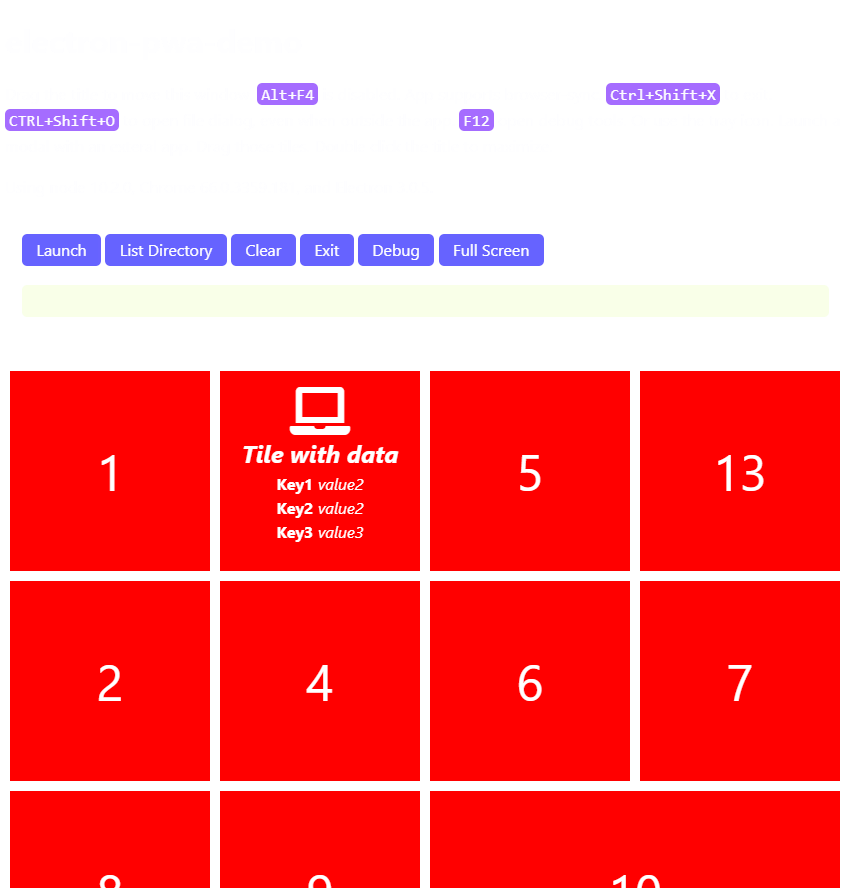

# electron-demo

I spent a little time learning how to use electron to create a windows application.

To get started with development

* run `yarn`
* run `yarn watch` in one console
* run `yarn dev` in another

